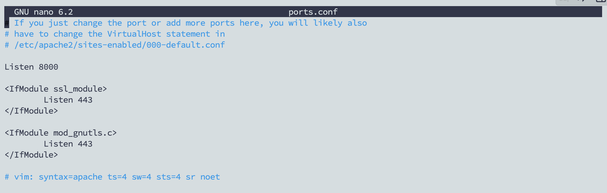

# MySQL

#### Cài đặt MySQL Server

```bash
sudo apt update
sudo apt install mysql-server
sudo systemctl start mysql.service
sudo mysql
```

#### Cấu hình MySQL

<pre class="language-bash" data-overflow="wrap"><code class="lang-bash">sudo mysql -u root -p
<strong>------
</strong>ALTER USER 'root'@'localhost' IDENTIFIED WITH mysql_native_password BY '123456';
FLUSH PRIVILEGES;

</code></pre>

#### Cài đặt phpMyAdmin


```bash
sudo apt install phpmyadmin php-mbstring \
php-zip php-gd php-json php-curl
```


Chọn máy chủ `apache2`

<figure><figcaption></figcaption></figure>

Thực hiện cấu hình mật khẩu của `MySQL` trên `PhpMyadmin`

<figure><figcaption></figcaption></figure>

Nhập mật khẩu của `MySQL`

<figure><figcaption></figcaption></figure>

Thay đổi cổng dịch vụ

```
nano /etc/apache2/ports.conf
```

<figure><figcaption></figcaption></figure>

```
sudo systemctl enable apache2 
sudo systemctl start apache2
sudo systemctl restart apache2
```
