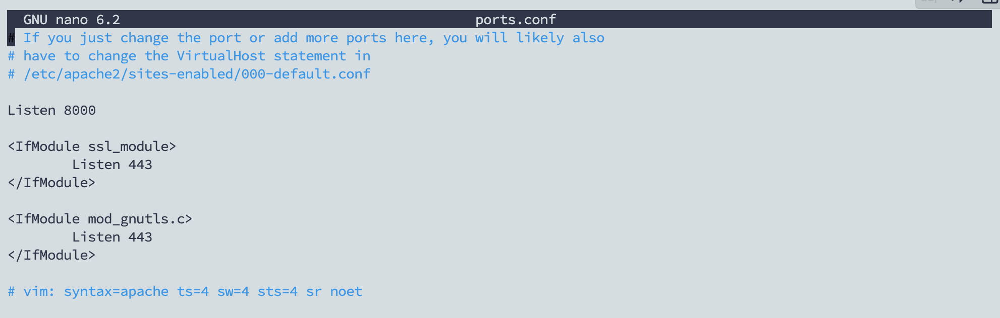

# SSH key-gen

### Generate SSH Key Pair

```bash
ssh-keygen -t rsa -P '' -f ~/.ssh/id_rsa
```

After executing the command line in the terminal, the result will look like the image below.

<figure><figcaption></figcaption></figure>

In there **`id_rsa.pub`** are the public key and the file **`id_rsa`** is the private key.
